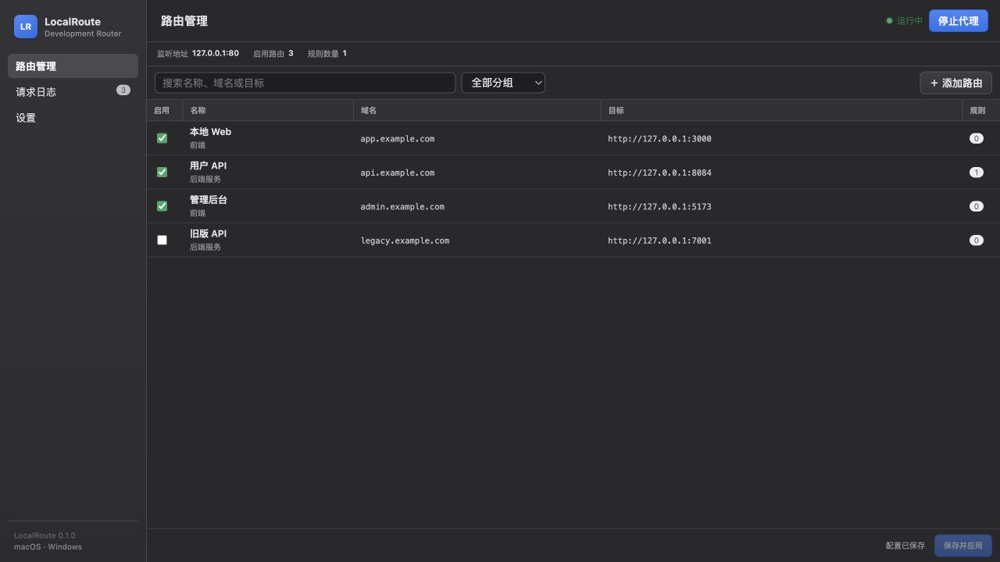
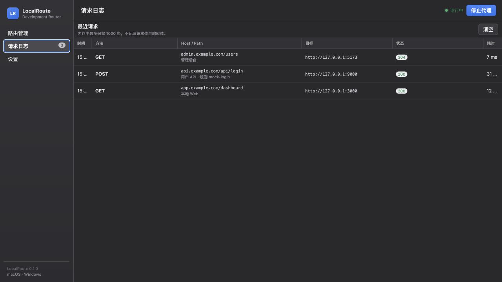

<p align="center">
  
</p>

<h1 align="center">LocalRoute</h1>

<p align="center">
  面向本地开发的轻量域名路由代理。一个程序同时提供桌面 GUI 和 CLI，支持 macOS 与 Windows。
</p>

LocalRoute 将指定开发域名的请求转发到本机或其他测试服务，适合前后端联调、微服务调试、Mock 分流等场景。配置使用 YAML 保存，修改后可即时加载；请求日志只存在内存中。

## 界面预览

### 路由管理



### 请求日志



> 截图使用 `example.com` 演示数据，不包含真实开发环境域名。

## 特性

- 单一程序同时支持 GUI 和 CLI
- 根据 Host 将请求转发到不同目标服务
- 支持按 HTTP 方法、精确路径或路径前缀配置条件规则
- YAML 配置，可由 GUI 或文本编辑器维护
- 配置变更自动校验并热加载
- 路由分组、搜索和启停控制
- 实时请求日志，最多保留最近 1000 条
- 请求日志仅保存在内存，不记录请求体、响应体、Cookie 或 Token
- macOS 监听 80 端口时按需申请管理员授权，应用主体仍以普通用户运行
- 单实例运行，关闭窗口后可继续保持代理服务

## 工作方式

假设本地前端运行在 `127.0.0.1:3000`：

```text
浏览器请求 http://app.example.com/
              │
              ▼
      /etc/hosts → 127.0.0.1
              │
              ▼
       LocalRoute :80
              │
              ▼
       127.0.0.1:3000
```

LocalRoute 不会自动修改系统 Hosts。使用开发域名前，需要自行将域名解析到 `127.0.0.1`。

macOS 示例：

```text
127.0.0.1 app.example.com api.example.com
```

## 安装与运行

可从 [Releases](https://github.com/goribun/localroute/releases) 下载对应系统的测试版程序包，并使用随包提供的 `.sha256` 文件校验下载内容。

### macOS

开发阶段可直接构建并打开：

```bash
wails build
open build/bin/LocalRoute.app
```

应用默认不自动启动代理。点击“启动代理”后，如果监听端口为 80，macOS 会弹出管理员授权窗口。授权只用于启动最小端口桥接进程，GUI 和代理核心仍以当前用户运行。

当前开发构建尚未进行 Apple 签名与公证。直接分发时，应将整个 `LocalRoute.app` 压缩为 ZIP，不要只发送内部可执行文件。

首次运行下载的测试版时，如 macOS 阻止打开，可在 Finder 中右键应用并选择“打开”，或前往“系统设置 → 隐私与安全性”允许打开。

### Windows

```powershell
wails build
build\bin\LocalRoute.exe
```

下载的测试版尚未使用商业代码签名证书，Windows SmartScreen 可能显示安全提示，可选择“更多信息 → 仍要运行”。

## 快速开始

1. 启动本地服务，例如 `127.0.0.1:3000`。
2. 在 Hosts 中将开发域名指向 `127.0.0.1`。
3. 打开 LocalRoute，新建路由。
4. 填写请求域名 `app.example.com`。
5. 填写默认目标 `http://127.0.0.1:3000`。
6. 保存配置并点击“启动代理”。
7. 打开 `http://app.example.com/`。

## YAML 配置

```yaml
version: 2
listener:
  address: 127.0.0.1
  port: 80
routes:
  - id: local-web
    name: 本地 Web
    group: 前端
    enabled: true
    host: app.example.com
    target: http://127.0.0.1:3000
    preserveHost: true
    rules:
      - id: mock-login
        name: 登录 Mock
        enabled: true
        priority: 100
        match:
          methods: [POST]
          path: /api/login
        target: http://127.0.0.1:9000
```

规则按 `priority` 从高到低匹配，相同优先级按配置顺序匹配，命中第一条后停止；没有规则命中时使用路由的默认目标。

每条规则的 `match` 必须且只能配置以下一种路径条件：

- `path`：精确匹配路径
- `pathPrefix`：匹配路径前缀

`methods` 可选；未填写时匹配所有 HTTP 方法。

## CLI

同一个 LocalRoute 程序也可以在终端使用：

```bash
localroute                                      # 打开 GUI
localroute start --config ./localroute.yml      # 前台运行代理
localroute check --config ./localroute.yml      # 校验 YAML 配置
localroute routes --config ./localroute.yml     # 输出已启用路由
localroute routes --config ./localroute.yml --json
localroute version
```

CLI 使用 80 端口时需要由调用方提供相应系统权限；CLI 不会弹出 GUI 管理员授权窗口。

## 配置文件

配置查找顺序：

1. CLI 的 `--config PATH`
2. 环境变量 `LOCALROUTE_CONFIG`
3. 当前目录的 `localroute.yml`
4. 操作系统用户配置目录

默认用户配置位置：

- macOS：`~/Library/Application Support/LocalRoute/localroute.yml`
- Windows：`%AppData%\LocalRoute\localroute.yml`

项目开发目录中的 `.app` 会向上查找 `localroute.yml`，方便直接调试本项目构建。

## 请求日志与隐私

请求日志只保存在当前进程内存中：

- 最多 1000 条
- 退出应用后自动消失
- 可随时在 GUI 中清空
- 不写入 YAML、数据库或请求日志文件
- 不保存请求体、响应体、Cookie 或 Token

记录字段仅包括时间、方法、Host、路径、转发目标、路由/规则标识、状态码、耗时和错误信息。

## 开发

需要：

- Go 1.26+
- Node.js 20.19+
- Wails v2.15

```bash
go install github.com/wailsapp/wails/v2/cmd/wails@v2.15.0
go test ./...
wails dev
```

生产构建：

```bash
wails build
```

主要技术栈：

- Go
- Wails
- Vue 3
- TypeScript
- Vite
- YAML v3

GitHub Actions 会分别在 macOS 和 Windows Runner 上执行测试并构建产物。

## 构建产物

- macOS：`build/bin/LocalRoute.app`
- Windows：`build/bin/LocalRoute.exe`

正式公开分发前，还需要为 macOS 完成代码签名与 Apple 公证，并为 Windows 安装包配置代码签名。

## License

本项目沿用仓库现有许可证，详见 [LICENSE](LICENSE)。
